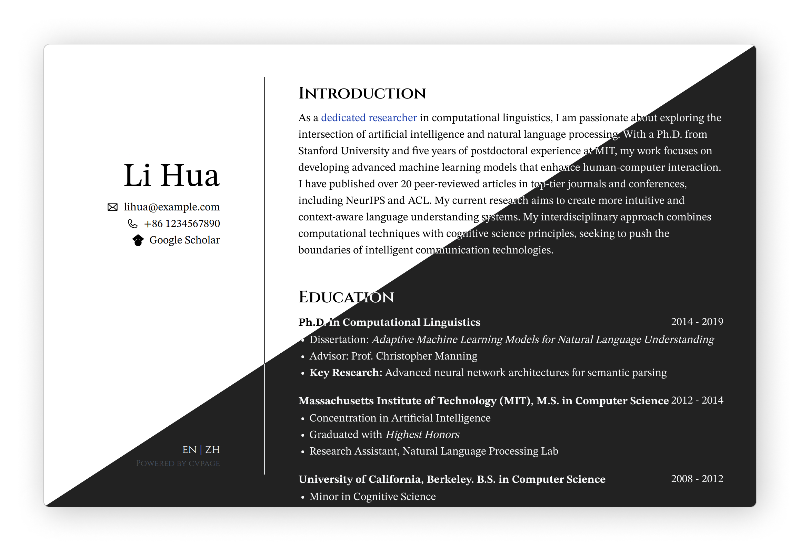

# CVPage



## Features

- Dark Mode Suppport
- Multiple Language Support

## Installation

To Build this project locally, you need to have Node.js and pnpm installed on your machine. Follow these steps:

```bash
git clone https://github.com/reonokiy/cvpage
cd cvpage
pnpm install
pnpm run dev

# for building for production
pnpm run build
# pnpm run preview
```
## Configuration

All configuration is done in the `content/` directory.

### `content/cv`

Currently only yaml files in the `content/cv` folder is available. Filename should be in format of `[lang].yaml`. For example, `en.yaml`, `zh.yaml`.

#### Components

- baseinfo
    - `v0.email`
    - `v0.phone`
    - `v0.github`
    - `v0.google-scholar`
- cvinfo
    - `v0.markdown` 
    - `v0.unordered-list`
    - `v0.unordered-list-with-item`

You can find all schemas in the [schema](./schema) directory.

```
# yaml-language-server: $schema=../../schema/cv.json
```

With this line on the top of your YAML file, you can get schema validation and auto-completion support.